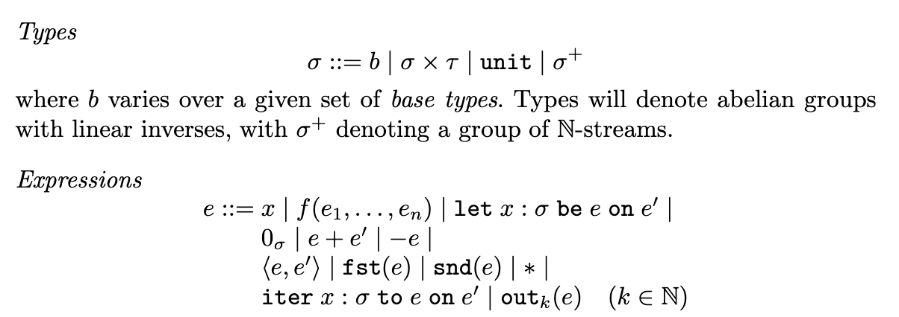

# Trauma: A Differential Dataflow Prototype Language

## Vision
For this project, I am creating a prototype language that displays the ideas of differential dataflow outlined in this paper: https://link-springer-com.proxy.library.cornell.edu/chapter/10.1007/978-3-662-46678-0_5.

Differential dataflow is a way of reusing computation when we are doing something iterative. For example, take an instance where we are changing the input and index each version of the input i. Then we want to apply a for loop on a given input and call the index of that for loop j. With differential dataflow, we will be able to use the computation done in (i',j') < (i,j) to formulate the (i,j)th answer.

Lets call the input after the (i,j)th iteration the (i,j)th version. We accomplish our efficiency by working on differences in versions instead of the full versions themselves. When we want to return the (i,j)th version, we are actually adding up all the differences in versions before (i,j) on the original input. This gives us the flexibility to change our input slighly and only do work where it is needed.

## Progress

We started by creating a very simple prototype language that contains the relevant types and expressions that are specified in the paper and are shown in the image in the bottom.



Currently the sigma type is modeled as just integers. The two more interesting expressions to note here are iter and out. iter takes in two expressions and returns a stream. out takes in an integer, k, and a stream and substitutes e' for x in e, takes that output, and feeds the output back as a substitute for e again for k number of times. In the future, we will be using the flexibility of sigma to model collections.
Here is an example test.

Input:
```
iteration = (iter x : int to 2 + x on 0);
print(out[10](iteration));
```
Output:
```
20
```

We currently do this in the naively by storing iter and its arguments as a stream datatype and when we call out on the stream, we repeatedly apply the function, $\lambda$x.e, onto e' for k times.

## Next Steps

The next steps for this project is to 
1) Represent collections
2) Represent differences between collections
3) Explore changing this to differential form as outlined in the paper so that we can use previous calculations to formulate new results. This will entail studying the iter and out expressions more deeply.
