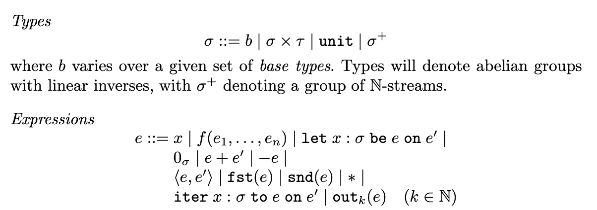

# Trauma: A Differential Dataflow Prototype Language

## Vision
For this project, I am creating a prototype language that displays the ideas of differential dataflow outlined in this paper: https://link-springer-com.proxy.library.cornell.edu/chapter/10.1007/978-3-662-46678-0_5.

Differential dataflow is a way of reusing computation when we are doing something iterative. For example, take an instance where we are changing the input and index each version of the input i. Then we want to apply a for loop on a given input and call the index of that for loop j. With differential dataflow, we will be able to use the computation done in (i',j') < (i,j) to formulate the (i,j)th answer.

Lets call the input after the (i,j)th iteration the (i,j)th version. We accomplish our efficiency by working on differences in versions instead of the full versions themselves. When we want to return the (i,j)th version, we are actually adding up all the differences in versions before (i,j) on the original input. This gives us the flexibility to change our input slighly and only do work where it is needed.

The way we do this is by keeping track of streams of data. Data is represented as collections or multisets, basically functions over domain X to integers. Streams are just indexed collections. In our case, we will be using streams to index the differences between the versions of our data. For example, say you have a collection {"apple" : 1, "pineapple" : 2}. Then we modify by subtracting apple, or {"apple" : -1}. So our stream in this case would be [1 : {"apple" : 1, "pineapple" : 2}, 2 : {"apple" : -1}]. In this project, we will only be integers for our collections.

When we do calculations on the collections, we will also be storing our outputs also as streams/indexed differences. The advantage of this is that by changing some operators (often times these are dataflow operators), we will be able to adapt to the next input change by simply working on a subset of the data.

## Progress

### Alpha
We started by creating a very simple prototype language that contains the relevant types and expressions that are specified in the paper and are shown in the image in the bottom.


Photo taken from https://link-springer-com.proxy.library.cornell.edu/chapter/10.1007/978-3-662-46678-0_5. 

Currently the sigma type is modeled as just integers. The two more interesting expressions to note here are iter and out. iter takes in two expressions and returns a stream. out takes in an integer, k, and a stream and substitutes e' for x in e, takes that output, and feeds the output back as a substitute for e again for k number of times. In the future, we will be using the flexibility of sigma to model collections.
Here is an example test.

Input:
```
iteration = (iter x : int to 2 + x on 0);
print(out[10](iteration));
```
Output:
```
20
```

We currently do this in the naively by storing iter and its arguments as a stream datatype and when we call out on the stream, we repeatedly apply the function, $\lambda$x.e, onto e' for k times. By the end, iter should be taking in collections instead of integers and should be doing the body functino because behind the scenes we will be storing differences between each iteration and our differential operators will be able to use those efficiently.

### Beta

#### Collections
The demo below shows how we represent collections. Forgive the formatting of the output but essentially col1 prints to “(1,0), (2,-1)” which means a collection where c(1) = 0 and c(2) = -1. You can see here that when we insert to an empty collection (EMPTY), we add upon the previous c(x). For simplicity and sake of time, we are going to allow this to be the only possible way to create collections.
```
Input:
col1 = EMPTY.insert((1, 0))
            .insert((2,1))
            .insert((2,-2));
col2 = EMPTY.insert((1, 0))
            .insert((2,1))
            .insert((2,-6));
print(col1);
print(col2);

Output:
(1, 0), (2, -1), ]
(1, 0), (2, -5), ]
```

#### Streams
Traces or streams are basically indexed collections. Index 0 in this case is col1 and index 1 is col2. For our implementation of differential dataflow, we will be using traces in order to keep track of differences. So the version of the set at index 1 is actually the pointwise sum of all the differences before and at that index, or {(1,0), (2,-6)}.

```
Input:
col1 = EMPTY.insert((1, 0))
            .insert((2,1))
            .insert((2,-2));
col2 = EMPTY.insert((1, 0))
            .insert((2,1))
            .insert((2,-6));
print(col1);
print(col2);

trace = TRACE(col1, col2);
print(trace);

Output:
(1, 0), (2, -1), ]
(1, 0), (2, -5), ]
Trace: 
(1, 0), (2, -1), ]
(1, 0), (2, -5), ]
]
End Trace
```

## Next Steps

The next steps for this project is to 
1) implement the differential iterator
2) implement at least 1 differential dataflow operator such as `join`
3) create an interesting example and measure time
